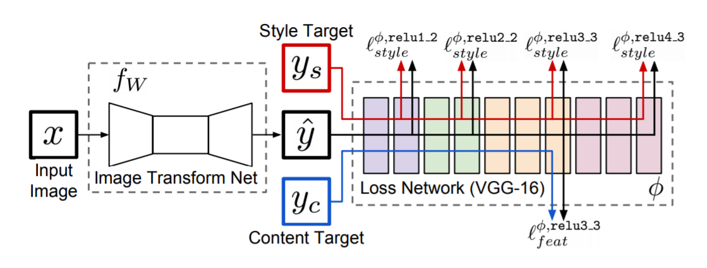
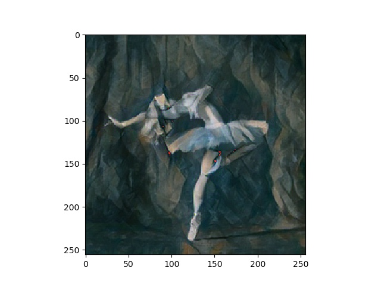

# Fast Nueral Style Transfer with pytorch

Fast neural style transfer network using pytorch

## Introduction

I followed Stanford course CS231, and found the topic Neural Style Transfer very interesting. 
The Neural-Style, or Neural-Transfer, is an algorithm that takes as input a content-image (e.g. a turtle), a style-image (e.g. artistic waves) 
and return the content of the content-image as if it was ‘painted’ using the artistic style of the style-image
Previous work used back proporgation on each pixel to generate an image from random noise. But their work used a generator network to generate stylized
 image from noise. So we only need one generator network for one style instead of one network for each image.  

## Methodology

1. Prepare data for the generator network
2. Build a residual generator network
3. Train the model
4. Output image
Note: Residual Network is very important for the generator, loss remains high if no residual module is used.

## Result
Contnet Image:  

Style Imahe:  

Output Image:  

## References:
https://pytorch.org/tutorials/advanced/neural_style_tutorial.html  
https://github.com/pytorch/examples/tree/master/fast_neural_style/neural_style  
https://arxiv.org/pdf/1603.08155.pdf